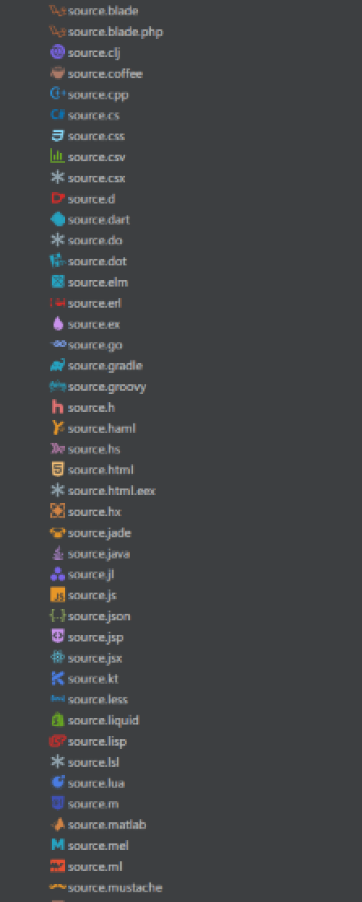
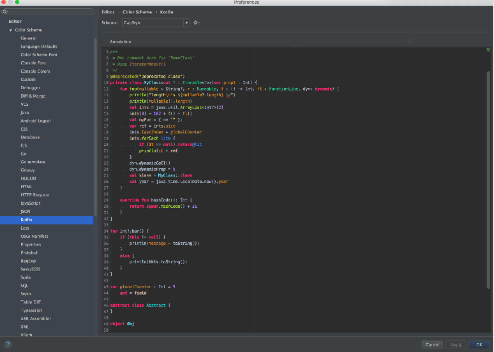
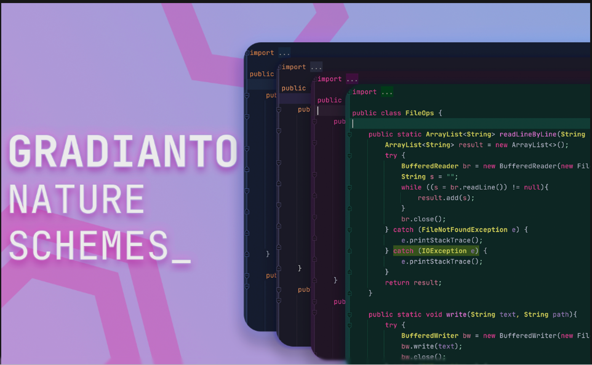

- [1. My PyCharm Plugins](#1-my-pycharm-plugins)
  - [1.1. Atom Material File Icons](#11-atom-material-file-icons)
  - [1.2. GapStyle Color Scheme](#12-gapstyle-color-scheme)
  - [1.3. Gradianto](#13-gradianto)
  - [1.4. HashiCorp Terraform / HCL language support](#14-hashicorp-terraform--hcl-language-support)
  - [1.5. IDE Eval Reset](#15-ide-eval-reset)
  - [1.6. Makefile Language](#16-makefile-language)
  - [1.7. Rainbow Brackets](#17-rainbow-brackets)
  - [1.8. Tabnine - AI Code Completion](#18-tabnine---ai-code-completion)

## 1. My PyCharm Plugins

### 1.1. Atom Material File Icons

Custom File and ==IDE Icons== for improved visual grepping.

### 1.2. GapStyle Color Scheme

### 1.3. Gradianto

### 1.4. HashiCorp Terraform / HCL language support

### 1.5. IDE Eval Reset

### 1.6. Makefile Language

### 1.7. Rainbow Brackets

### 1.8. Tabnine - AI Code Completion

